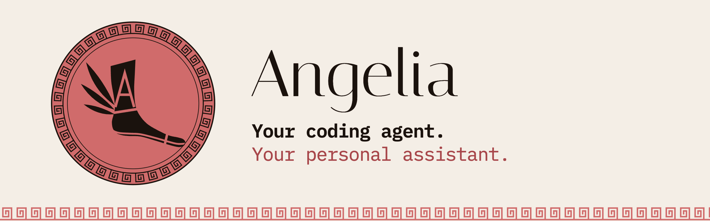

<p align="center">
  
</p>

# Angelia

<p align="center">
  <a href="https://useangelia.com">Website</a> | <a href="docs/reference.md">Docs</a> | <a href="https://github.com/korengast/angelia/releases">Releases</a>
</p>
<p align="center">
  <a href="https://useangelia.com"></a>
  <a href="https://github.com/korengast/angelia/releases/tag/v0.2.1"></a>
  <a href="#backends"></a>
  <a href="LICENSE"></a>
</p>

**Your coding agent. Your personal assistant.** Angelia turns the coding agent CLI you already know and trust into the brain of your personal assistant. You reach it from WhatsApp or Telegram; it runs on your own Mac, with your files, your tools and the subscription you already pay for. Give each part of your life its own chat and its own folder, and each one gets its own instructions and memory.

Angelia runs no model of its own. It carries messages, files and approvals between your chats and your agent, and nothing else. Bring the CLI you use, keep its skills and MCP servers, and switch any time: see [Backends](#backends).

> In Greek myth Hermes carried the words of the gods. His daughter **Angelia** (Ἀγγελία, *message, tidings*) inherited only the message itself: not the wisdom in it, not the decision behind it, just the promise that what was said in one place would arrive whole in another. That is the entire ambition of this project.

<table>
<tr><td><b>Lives in your chats</b></td><td>WhatsApp and Telegram, groups included, from one small daemon. It answers only when mentioned, and only the people you allow.</td></tr>
<tr><td><b>One chat, one folder</b></td><td>Each topic gets its own folder and memory, each chat its own session: the house, money, a side project. Instruction files, settings, MCP servers and hooks work exactly as in your terminal.</td></tr>
<tr><td><b>You approve risky steps</b></td><td>Before a command the profile does not allow on its own, the chat shows it and waits for your <code>yes</code>. No answer means no.</td></tr>
<tr><td><b>Voice, photos and files</b></td><td>Send a voice note, a photo or a PDF; get files and voice notes back. Speech is turned into text and back on your machine.</td></tr>
<tr><td><b>New chat, new assistant</b></td><td>Mention the bot in a new group and it sets up its own folder, then asks what the group is for.</td></tr>
<tr><td><b>Scheduled check-ins</b></td><td>A morning summary, a weekly report. Your operating system runs the timer; the answer lands in the chat.</td></tr>
<tr><td><b>Safe by default</b></td><td>Every profile is compiled with deny rules for your credentials and the other profiles' folders, and one whose rules were loosened is not started. Releases are signed, and the installer checks them.</td></tr>
<tr><td><b>No new bill</b></td><td>No second model, no Angelia server, no telemetry. API keys are kept out of the agent's environment, so no chat can move you to per-token billing.</td></tr>
</table>

---

## Quick start

### macOS

```bash
curl -fsSL https://useangelia.com/install | sh
```

The installer checks Node, fetches the newest release, **verifies its signature** (release key `SHA256:74hZgwt/ABiUQz6C9A1r7hpHZtCRq1KfC1KvvCR1ys0`), installs it and starts the setup wizard. The wizard asks for a bot token and which CLI to use, makes your first profile, and pairs the chat when you send the bot a message.

You need:

- **Node 22 or newer** and **git** (it comes with the Xcode command line tools).
- **A supported coding agent CLI**, installed and signed in to your own account. See [Backends](#backends).
- **A Telegram bot.** Open [@BotFather](https://t.me/BotFather), send `/newbot` and keep the token ready. It is stored on your disk, never in a chat.
- Optional: `brew install openai-whisper ffmpeg` for voice notes, and `brew install tmux` (3.7+) to run a Claude Code profile in its full screen, so the chat also shows up in the Claude app.

After installation:

```bash
angelia service install   # keep it running: starts at login, comes back after a crash
```

Then send *"what is in this folder?"* to your bot. The agent answers from the profile's folder.

> **Linux and Windows:** not yet. The daemon is plain Node, but the service, the timers and the built-in voice use macOS today. Linux with a systemd unit is next.

---

## Getting started

```bash
angelia init                         # setup wizard: bot token, CLI, first profile, pair the chat
angelia status                       # what is running, and which chats are warm
angelia check-config                 # validate routing.yaml and warn about risky combinations
angelia profiles                     # every profile and the chats routed to it
angelia profile add <platform:chat>  # a new profile and route for a chat, by hand
angelia compile <profile> --write    # write a profile's tools and deny rules into its CLI settings
angelia pair                         # link WhatsApp by QR
angelia jobs install                 # turn each profile's angelia-jobs.yaml into timers
angelia send <chat> <text>           # post into a chat from any script
angelia turn <chat> <text>           # ask that chat's agent; the answer lands in the chat
angelia update                       # install the newest signed release; your profiles are not touched
angelia guide                        # the manual your agent reads before it changes the setup
```

📖 **[Full reference →](docs/reference.md)**

---

## How it works

Four words, and one file that ties them together.

- **Profile.** A folder where your agent works: its instruction file, its memory, its settings. The agent opens there exactly as in your terminal.
- **Route.** One line that sends one chat to one profile.
- **Session.** Every chat keeps its own conversation with the agent, across restarts.
- **Owner.** Who may approve what the agent wants to run and use the chat's commands. In a direct chat, that is you.

```yaml
profiles:
  coding: { cwd: ~/.angelia/workspace/profiles/coding, permission_mode: acceptEdits, add_dirs: [~/code] }
  house:  { cwd: ~/.angelia/workspace/profiles/house,  permission_mode: acceptEdits }

routes:
  - { platform: telegram, chat: 111111111,      profile: coding }
  - { platform: telegram, chat: -1001234567890, profile: house, owners: [111111111], allow_from: [111111111, 333333333] }

telegram: { token_env: TELEGRAM_BOT_TOKEN }
```

The wizard writes this file for you, in `~/.angelia/workspace/routing.yaml`. With onboarding on, a new chat adds its own profile and route the first time you mention the bot there.

---

## Chat commands

Answered by Angelia itself, without spending a token. Registered in Telegram's command menu.

| Command | What it does |
| --- | --- |
| `/new` | Start a fresh session; the old one stays in history |
| `/resume` | List past sessions and switch back to one |
| `/stop` | Interrupt the current turn |
| `/status` | The active session, its turns and last use |
| `/model`, `/effort` | Alone: the one in use and the choices the CLI offers. With a value: set it for this session only |
| `/backend` | Alone: the CLI in use and the ones installed. `/backend codex`: move this profile to another CLI, with a fresh session |
| `/sh <command>` | Run a shell command in the profile folder, no agent (opt-in per profile) |
| `/restart` | Check the routing table, then restart Angelia; it says "back up" when it is |
| `/help` | The list |

Owners only, except `/help` and `/status`. Any other slash command goes to your CLI, so its own commands (`/compact`, a custom one) work from the chat too.

---

## WhatsApp

Add `whatsapp: { auth_dir: ~/.angelia/wa }` to the table and run `angelia pair`. It opens a local page with a QR code; on the phone that owns the number, choose *Linked devices > Link a device* and scan it.

> **Use a second, established number, not your personal one.** Angelia ignores what its own account sends, so on your personal number it would not hear you, and it would answer as you. Its link can also read every chat on that account. And WhatsApp bans newly created numbers that start acting like robots, often within hours.

---

## Security in one minute

An assistant that can read your files can be talked into reading them aloud. Read the [security model](docs/security.md) before you give the bot to anyone but yourself.

- Only chats in the table reach the agent. In a group, only the owners are heard unless you name others.
- Only owners approve commands, change the session or restart. A group member's typed "yes" is refused.
- What the agent may do is its CLI's own permission mode. For a profile other people talk to, keep a cautious mode or set `sandbox: true`.
- Prompt injection is not solved: a web page or a forwarded message can still talk the agent into anything its permission mode allows.

Found a hole? Report it privately: [SECURITY.md](SECURITY.md).

---

## Backends

| CLI | `backend:` | Status | Needs |
| --- | --- | --- | --- |
| Claude Code | `claude-code` (default) | supported | 2.1.270 or newer, signed in to claude.ai |
| Grok Build | `grok` | supported | 1.0.13 or newer, `grok login` |
| Codex | `codex` | supported | 0.157 or newer, `codex login` |
| pi, OpenCode | | coming soon | |

Each chat keeps one warm process, so a message never waits for a CLI to start. Permission prompts reach the chat on all three. Codex runs inside its own sandbox, which the operating system enforces: Angelia hands it the profile's rules, so it writes only in its folders and cannot read your credentials or the other profiles, shell commands included. Every CLI plugs into the same small interface in `src/brain/`, and nothing else in Angelia knows which one is running.

---

## Documentation

| Page | What's covered |
| --- | --- |
| [Features in detail](docs/reference.md#features-in-detail) | Sessions, gating, onboarding, the permission relay, files, voice, delivery, jobs, export |
| [Your CLI brings the capabilities](docs/reference.md#your-cli-brings-the-capabilities) | Skills, MCP servers and folders per profile, compiled into each CLI's settings |
| [Setting things up by hand](docs/reference.md#setting-things-up-by-hand) | Profiles, Telegram, the table, WhatsApp, Chrome, `/sh`, the service, updates |
| [The instance](docs/reference.md#the-instance) | `~/.angelia`: the workspace in git, and the state that never is |
| [Files](docs/reference.md#files) | Every file Angelia keeps, and what is in it |
| [Security model](docs/security.md) | Who can reach and command the agent, secrets, the sandbox, logs, what leaves your machine |
| [Runbook](docs/runbook.md) | Day-to-day commands, known failures and their fixes, cutting a release, uninstalling |
| [Decisions](docs/decisions/) | Why it is built this way, with the CLI versions each finding was measured on |

---

## FAQ

**What does it cost?** Angelia is free and MIT-licensed. You pay only for your CLI's own subscription. Telegram bots and linked WhatsApp devices are free.

**Does anything go through an Angelia server?** No. There is no Angelia server, account, telemetry or update check. Each turn goes to your CLI's model provider under that CLI's terms. Telegram keeps bot messages on its servers; WhatsApp messages are end-to-end encrypted to the linked device.

**Does my computer have to stay on?** Yes, the agent runs on it. A Mac mini or an always-on laptop is the usual home.

**Can other people in a group use it?** Yes, if you list them in `allow_from`. They can talk to the agent; they cannot approve its commands.

**How do I update?** `angelia update` installs the newest signed release and never touches your profiles. Then send `/restart`.

**How do I remove it?** Six commands, in the [runbook](docs/runbook.md#uninstall).

---

## Non-goals

Angelia is not an agent and will not become one. No second model, no skills system, no memory framework, no scheduler in the daemon, no plugin marketplace. Knowledge belongs in the profile's instruction file; scheduled work belongs to the operating system, which `angelia jobs` only sets up. No payments: the agent sends you a checkout link and you pay on your phone.

**Next:** pi and OpenCode backends. Linux with a systemd unit. `/profile` to switch which assistant answers a chat.

---

## Contributing

Contributions are welcome. Read [CONTRIBUTING.md](CONTRIBUTING.md) first: it is short.

```bash
git clone https://github.com/korengast/angelia && cd angelia
npm ci --ignore-scripts && npm run build
npm test                                          # macOS with tmux: types, the suite, then a real pack and install
ANGELIA_STATE_DIR=$(mktemp -d) npm run dev -- init  # a scratch instance that never touches yours
```

- 🐛 [Issues](https://github.com/korengast/angelia/issues)
- 🔐 [Security reports](SECURITY.md), privately, never in an issue
- ✉️ [info@useangelia.com](mailto:info@useangelia.com) for anything that is not a bug report

---

## License

MIT — see [LICENSE](LICENSE).
